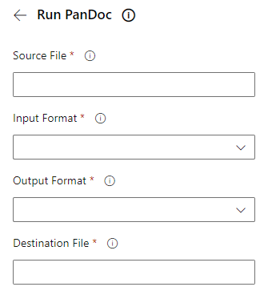
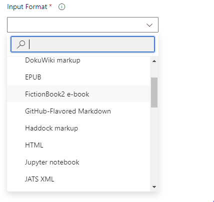

# Overview

An Azure Pipeline task that allows you to run the [PanDoc](https://pandoc.org/) tool in your pipelines.

# Usage
The extensions supports use of the assistant view to help you to configure your PanDoc.



The assistant will help you to choose the supported input and output formats.



# Sample 

Before using the `RunPanDoc` tool, run the `DownloadPanDoc` stage. This will install the latest version of PanDoc.

Below is a sample YAML entry for executing the PanDoc tool.

```yaml
- task: RunPanDoc@1
  displayName: Convert Github Markdown to HTML
  inputs:
    sourceFile: '$(System.DefaultWorkingDirectory)/Test/test.md'
    inputFormat: 'gfm'
    outputFormat: 'html5'
    destFile: '$(Build.ArtifactStagingDirectory)/test.html'
    additionalArgs: '--toc'
```

# Argument

Below are the arguments for the task, and the [corresponding argument in Pandoc](https://pandoc.org/MANUAL.html#general-options)

| Argument     | Description                                      | Corresponding PanDoc Command Line Argument |
|--------------|--------------------------------------------------|--------------------------------------------|
| sourceFile   | The (full) path to one or more files to convert. |                                            |
| inputFormat  | The format of the source file.                   | -f                                         |
| outputFormat | The format of the destination file.              | -t                                         |
| destFile     | The (full) path where to save the new file.      | -o                                         |

# License 
Copyright (C) 2020-2025 Code Vanguard LLC

All rights reserved